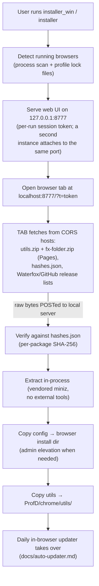
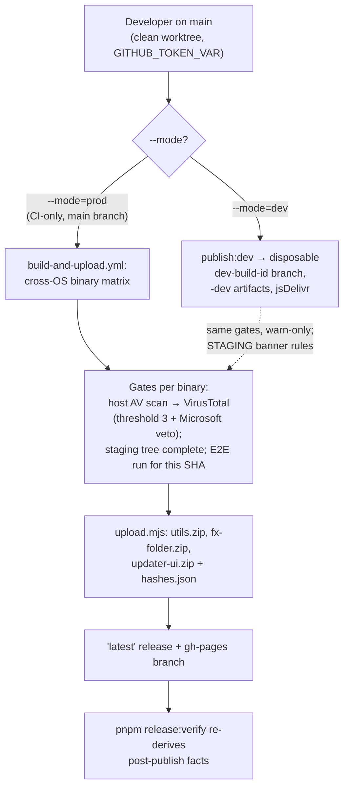

# Developer Guide

This project is not a monorepo — it is a single-project repo with several components (installer,
publish scripts, chrome scripts, web UI) that are versioned and released together. All of them serve
one goal: installing and updating Firefox scripts for legacy extension support.

## Repository structure

```
├── core/
│   ├── chrome/utils/       Chrome scripts loaded by Firefox
│   │   ├── updater/        In-browser updater scheduler (scriptsUpdater.sys.mjs,
│   │   │                   updater-config.sys.mjs; the tab UI lives in tools/publish/remote-ui/)
│   │   └── BootstrapLoader.js     Bootstraps the chrome set; inits scriptsUpdater
│   ├── fx-folder/          Config files (config.js, config-prefs.js)
│   └── chrome.manifest     Chrome registration
├── installer/              C installer application (cross-platform)
│   ├── src/                C source files & headers (+ helper/ elevated-copy binary)
│   ├── web/                Web UI served by the installer
│   ├── Makefile            Build targets (win, linux, mac)
│   └── embed.mjs           Embeds web assets into C resources.h
├── tools/publish/          Release-publishing scripts (Node.js)
│   ├── upload.mjs          publish engine: hash diff → rebuild changed zips +
│   │                       binaries → upload release assets + Pages → update hash
│   │                       manifest (--mode=prod|dev, --local/--force, --platform=)
│   ├── createZip.mjs       Zip creation helpers (fx-folder.zip, utils.zip, updater-ui.zip)
│   ├── generateUpdaterConfig.mjs  Regenerates updater-config.sys.mjs from installer.conf
│   ├── syncGeneratedFiles.mjs     Regenerates the generated files (untracked, on demand)
│   ├── generatedRegistry.mjs      Single registry of the generated files: shipping rels,
│   │                              zip/hash extraFiles, scan excludes (ADR 0008)
│   ├── gitignoreUtils.mjs  File-listing with gitignore support
│   ├── hashUtils.mjs     Directory hashing & gh-pages hash manifest
│   ├── publishMode.mjs   --mode=prod|dev gate, dev-build-<id> identity, -dev suffix
│   ├── publishCommon.mjs  Shared token/branch-gate/date/gitignore helpers
│   ├── uploadUtilsZip.mjs  GitHub release-asset helpers (library)
│   ├── uploadToPages.mjs   Pushes zips/helpers/manifest to the gh-pages branch (library)
│   ├── remote-ui/          Updater tab UI source (updater.html, updater.js, updater-ui.js, logos/)
│   └── paths.js          Configurable constants (read from config/installer.conf)
├── config/
│   ├── installer.conf      Single source of truth for URLs/repos (→ _config.h, paths.js,
│   │                       updater-config.sys.mjs)
│   └── eslint.config.js, prettier.config.js
├── package.json            Root config (lint/format + publish:*/snapshot:*)
└── pnpm-workspace.yaml     Root-only workspace settings
```

## Prerequisites

| Component       | Requirement                           | Install                                                    |
| --------------- | ------------------------------------- | ---------------------------------------------------------- |
| C installer     | GCC or clang; Node.js for `embed.mjs` | (see per-OS below)                                         |
| Publish scripts | Node.js ≥ 24, pnpm                    | `apt install nodejs pnpm` / `winget install OpenJS.NodeJS` |
| Chrome scripts  | A Firefox-family browser              | —                                                          |

### Windows

Install MSYS2 (use the **UCRT64** environment — `C:\msys64\ucrt64.exe`), then in its shell:

```bash
pacman -Syu                                   # update package DB
pacman -S mingw-w64-ucrt-x86_64-gcc           # gcc
pacman -S mingw-w64-ucrt-x86_64-binutils      # windres + objdump (helper_win, verify)
pacman -S mingw-w64-ucrt-x86_64-make          # mingw32-make.exe (cmd / PowerShell)
pacman -S make                                # MSYS make.exe (runs recipes via sh)
```

Node.js is required for the `resources` step (`node embed.mjs`). Install it inside MSYS2
(`pacman -S mingw-w64-ucrt-x86_64-nodejs`) or use an existing Windows Node.js install — MSYS2 shells
keep the Windows PATH, so either works.

`installer/src/_config.h` (like `resources.h` and `updater-config.sys.mjs`) is **not committed** —
it is gitignored and regenerated on demand: the `config` target of the Makefile regenerates it from
`config/installer.conf` on every build (see the Generated files section below).

Build from the `installer/` directory in any of the three shells:

**MSYS2 UCRT64 shell:**

```bash
cd installer
make all          # → dist/installer/installer_win.exe
```

**cmd.exe** — add both MSYS2 binary directories to PATH (the `config` step regenerates `_config.h`
via `node tools/publish/syncGeneratedFiles.mjs`), then use `mingw32-make`:

```cmd
set PATH=C:\msys64\ucrt64\bin;C:\msys64\usr\bin;%PATH%
cd installer
mingw32-make dist_win
```

**PowerShell — same idea:**

```powershell
$env:PATH = "C:\msys64\ucrt64\bin;C:\msys64\usr\bin;$env:PATH"
cd installer
mingw32-make dist_win
```

With `sh.exe` on PATH (as above), `mingw32-make` runs recipes via `sh`; without it, it falls back to
`cmd.exe`, whose builtin `mkdir` has no `-p`. The Makefile probes the recipe shell at parse time and
uses a compatible `mkdir` either way, so the same targets work from cmd.exe, PowerShell, and MSYS2.

**Note:** `-mwindows` links the executable as a GUI-subsystem app so double-clicking from File
Explorer does not open a terminal. Verify with:
`objdump -p dist\installer\installer_win.exe | grep Subsystem` should show `2` (GUI).
`mingw32-make verify` checks both this and the PE structure (see the Defender note below).

**Defender write-lock race on local links (issue #233).** Windows Defender's real-time scan can
intermittently hold a write lock on the freshly linked `installer_win.exe` while `collect2`/`ld` is
still writing it — the link dies with `collect2.exe: error: ld returned 5 exit status` and/or the
exe is left truncated (a few hundred bytes, no PE structure). `make verify` catches the truncated
output immediately (MZ/e_lfanew/PE-signature check). If it fires:

1. Just re-run the link — the race is transient and a retry usually succeeds.
2. If it recurs, exclude the build output dir from real-time scanning (Windows Security → Virus &
   threat protection → Exclusions → `<repo>\dist`, your repository's `dist` directory), or pause
   real-time protection for the build.
3. CI is unaffected: GitHub Actions Windows runners have Defender's real-time scan disabled, and the
   publish gate re-checks every staged binary's magic bytes before hashing (#234).

### Linux (native or WSL)

```bash
sudo apt install gcc
make all                      # builds dist/installer/installer_linux

# ARM64 (cross-compile; a native aarch64 host can pass AARCH64_CC=cc)
sudo apt install gcc-aarch64-linux-gnu
make dist_linux_aarch64 helper_linux_aarch64
#   builds dist/installer/installer_linux_aarch64 + helper_linux_aarch64
#   upload.mjs builds both automatically: 'linux' implies the aarch64 twin

# Windows cross-compile from Linux/WSL
sudo apt install gcc-mingw-w64-x86-64-posix binutils-mingw-w64-x86-64
make dist_win CC=x86_64-w64-mingw32-gcc WINDRES=x86_64-w64-mingw32-windres
#   builds dist/installer/installer_win.exe with the PE version resource
```

### macOS

```bash
xcode-select --install
make dist_mac   # builds dist/installer/installer_mac
```

The macOS build is **universal** (x86_64 + arm64 in one binary, mirroring `helper_mac`), so the
single `installer_mac` asset serves Apple Silicon and Intel Macs — verify with
`lipo -archs dist/installer/installer_mac` (the E2E macOS runner asserts both slices and executes
each one; #132).

## AV false positives and the AV scan gate

The installer/helper binaries are unsigned, stripped, statically-linked PEs — the classic profile
for antivirus **machine-learning** false positives. `installer_win.exe` was once flagged by Windows
Defender (`Program:Script/Wacapew.A!ml`) while every local build of the same source scanned clean.
The confirmed root cause was a **toolchain bump, not a code change**: the publish workflow ran
`msys2/setup-msys2` with `update: true`, and a full `pacman -Syu` on 2026-09-05 pulled the gcc
16.1.0 → 16.2.0 package update (published to MSYS2 repos the day before). The rebuilt artifact's
bytes landed inside the `!ml` model's detection pocket (the near-identical dev-mode build and all
local 16.1.0 builds scanned clean). `!ml` models are byte-sensitive and change over time, so the
workflow now skips the system upgrade (`update: false`) — the AV gate below is what enforces that a
rebuild with any new toolchain still scans clean before it ships. Three structural measures keep
this in check:

1. **PE metadata** — `installer/src/installer.rc` + `installer.manifest` (compiled by `windres` on
   the Windows build) give the exe a version resource (FileDescription/CompanyName/ProductName), an
   asInvoker manifest and Win10/11 compatibility GUIDs. A stripped PE with _no_ version info is the
   #1 ML false-positive profile — and an **unmanifested** exe is the other: Windows applies
   installer-detection and UAC virtualization heuristics to it. `helper_win.exe` therefore carries
   the same pair as the installer (`installer/src/helper/version.rc` + `helper.manifest`), instead
   of relying on the mingw crt's auto-linked `default-manifest.o`: the crt version CI installs did
   not supply one, so the shipped helper used to have a version resource and no manifest at all.
   Both PEs also carry an **icon resource** — `installer/src/installer.ico`, reused by
   `src/helper/version.rc` — rendered at 16/24/32/48/128/256 px from the updater's own
   `tools/publish/remote-ui/logos/favicon.svg` by `tools/make-installer-icon.mjs` and committed
   (re-run that script after an artwork change; it needs a local Chrome, so it never runs in CI).
   Without it Explorer and the taskbar show a blank-document glyph, and the PE is one more piece of
   missing metadata.
2. **The AV scan gate** — `tools/scan-av.mjs` scans built binaries before they are published
   (Windows: Windows Defender via `MpCmdRun.exe`; Linux/macOS: ClamAV `clamscan`). The publish flow
   (`tools/publish/upload.mjs`) scans the EXACT bytes about to be uploaded and refuses to publish
   when any engine reports a detection. A missing engine is only a warning (GitHub Windows runners
   often run Defender in passive mode), so the gate degrades gracefully but never ships a flagged
   artifact silently.
3. **The magic-byte artifact check** — before hashing and publishing, `upload.mjs` verifies every
   staged installer/helper binary starts with its platform's executable magic (PE `MZ`, ELF,
   Mach-O). This guards against issue #233: Defender real-time protection on a local Windows host
   can intermittently hold a write lock on the freshly linked exe and leave a truncated artifact
   behind (`collect2: ld returned 5`, output starting `00 00`) — a partial file that would otherwise
   be hashed and shipped. The check runs after the build/reuse pass and again before the pass-2
   security gates. If it fires: delete the named artifact(s) and re-run the build (the link usually
   succeeds on retry).
4. **No shell surface** — neither binary starts a command interpreter. The forced browser close
   walks the process snapshot and terminates the tree itself (`terminate_process_tree()` in
   `installer/src/restart.c`) instead of shelling out to `taskkill /t`, and Ctrl+C is handled purely
   through the console API: `SetConsoleCtrlHandler(NULL, FALSE)` restores Ctrl+C delivery for the
   new process group Windows PowerShell 5.1 starts native processes in (measured against a new-group
   parent: plain child = no `CTRL_C_EVENT`, re-enabled child = `CTRL_C_EVENT`), which retired the
   global-keyboard-polling watchdog and its terminal image-name list along with it. A GUI exe that
   launches `cmd.exe` to kill a process tree, plus `GetAsyncKeyState` polling in a background
   thread, is precisely the behaviour process-detection heuristics score; removing it is hygiene
   with an FP side effect, not a cure.

### Local scan (after `make dist_win`)

```bash
pnpm scan:av -- dist/installer/installer_win.exe dist/installer/helper_win.exe
# exit 0 = clean, exit 1 = detection, exit 2 = usage
```

### Multi-engine check (optional — VirusTotal)

```bash
# put VT_API_KEY=... in the root .env (gitignored), then:
pnpm scan:vt -- dist/installer/installer_win.exe
```

The publish flow also runs every built binary through VirusTotal when `VT_API_KEY` is present
(GitHub secret on CI; root `.env` for the local `snapshot:*` scans). The publish fails when ≥
`VT_FAIL_THRESHOLD` (default 3) engines report a binary as malicious **or** when a veto engine
(`VT_VETO_ENGINES`, default `Microsoft`) reports it as malicious at any count — a Microsoft/Defender
verdict must never ship, even alone. Hits below the configured threshold from non-veto engines warn
but do not block (the known-FP band at the default of 3). The run log names the flagging engines.
Without a key it just skips with a warning, and an analysis VirusTotal has not finished when the
poll times out is reported as a skip — never as clean.

Three operational facts promoted from the 2026-09 postmortem drafts (`.local` untracked at the time;
attributed there, repeated here as measured history, not as current config):

- **The VT gate is effectively the whole CI publish gate.** In the blocking 2026-09-15 run both
  native AV layers silently no-op'd (runner scanner unavailable), so only VirusTotal judged the
  bytes. "A missing engine is only a warning" means the other layers can vanish without failing — do
  not assume a green publish implies a host-AV scan happened.
- **A VT verdict is hash-stable — re-dispatch cannot clear it.** Since the build-date change (#162),
  the PE hash is a deterministic function of the commit, so the same commit re-built and
  re-dispatched gets the same verdict. "Re-run failed jobs" wastes a cycle; clearing a blocked
  publish needs either a source change (new bytes), a false-positive filing (WDSI, below), or a
  threshold/engine config change.
- **The Microsoft veto — not the threshold — is what blocked the installer.** Measured 2026-09-07:
  `installer_win.exe` was refused at 2 malicious (below the default threshold of 3) purely because
  the Microsoft engine flagged it, while `helper_win.exe` cleared both bars. When debugging a
  refusal, read which condition fired: a single Microsoft hit vetoes at any count.

### Verdict ledger and the published-binary watchdog

A verdict is evidence about ONE hash, and every rebuild produces a new one — which is why a WDSI
"incorrect detection" clearance does not carry over to the next build. Two mechanisms keep that
evidence usable instead of buried in run logs:

- **The ledger** (`tools/ci/avLedger.mjs`; written by the publish flow to `dist/vt-ledger.json`, and
  by `pnpm scan:vt --ledger <file>`) stores a per-hash record: band, engine counts, flagging
  engines, first/last sighting. The worst band a hash was ever seen in sticks, while `lastVerdict`
  records the newest observation, so "flagged once, clean since" stays visible instead of being
  erased. A publish run appends the table to the job summary — the warn band (1–2 engines, below the
  fail threshold) is otherwise only in the step log.
- **The published-binary watchdog** (`.github/workflows/av-watchdog.yml`, weekly + manual dispatch
  with a `ref` input) hashes the installer/helper binaries on the published surface and asks
  VirusTotal about each hash — a lookup, never an upload. The publish gate only judges the bytes one
  run uploads, so a verdict that flips _after_ a clean publish (exactly the 2026-09-05 shape) is
  invisible without this. Findings surface as one `[av-watchdog] published binaries` meta issue plus
  a deduped issue per flagged hash, auto-closed when a later run sees the hash clean. Without
  `VT_API_KEY` it records hashes as `unknown` (never clean); it never fails the job — a flagged
  published binary is a triage item, not a broken pipeline.

### False-positive handling

- If a scanner flags a freshly built binary, do **not** publish it — investigate first. Local builds
  and the CI artifact differ (toolchain package set — measured below), so a clean local scan does
  not guarantee the CI build is clean; the upload gate is what enforces that. To keep shipping the
  parts that are clean, use the partial-publish holdback below instead of freezing the whole run.
- Report confirmed false positives to Microsoft (Defender/other Microsoft engines):
  <https://www.microsoft.com/en-us/wdsi/filesubmission> — select “Your app or file was incorrectly
  detected as malware” and attach the flagged binary. Microsoft can clear the hash/family in
  Defender’s cloud, which also clears it for users.
- A durable long-term fix is **code signing**; it is the only measure that systematically improves
  AV/OS reputation. The measures above are the zero-cost alternative until a signing path lands —
  the signing plan and its status live on the tracking issue (#157) and are deliberately not
  documented here until a provider is approved and wired in (#159). **SignPath risk (recorded
  2026-10-07):** the SignPath application ticket has been unresponsive since 2026-09-10, so signing
  is not a near-term plan but an open dependency nobody is currently moving — the maintainer
  decision is to **reapply to SignPath after more stars and more downloads for `installer_win.exe`**
  (#159 carries the reapply note). Until then the unsigned-binary posture above stands.
- AV-shape changes are a lottery, not a dial: the 2026-09-07 PE subsystem bump (5.2 → 6.0, the
  XP-era "packer profile" signal) was reverted the same day because it _flipped_ Microsoft's ML
  verdict (#160 → #161). Do not churn binary bytes expecting a fix — the gate plus signing are the
  levers; measure before/after with `pnpm scan:av` / `pnpm scan:vt`.

### Why a clean local scan does not clear a CI build (measured 2026-09-17)

`snapshot:*` and the CI publish build the same sources but **not the same bytes**. Only the gcc
version is effectively pinned (`msys2/setup-msys2` with `update: false` still installs the current
`mingw-w64-ucrt-x86_64-*` packages); binutils, the mingw-w64 crt and the headers package float.
Measured on commit `e393191` — the CI build that VirusTotal flagged on 2026-09-15 (issue #157):

| Build                        | gcc      | binutils      | `installer_win.exe` | `helper_win.exe` |
| ---------------------------- | -------- | ------------- | ------------------- | ---------------- |
| CI (`staged-win` artifact)   | 16.1.0-5 | 2.46-4        | 199,168 B           | 18,944 B         |
| local (`pnpm snapshot:prod`) | 16.1.0-5 | 2.47.20260726 | 203,264 B           | 19,456 B         |

Reproducing the CI bytes locally needs CI's whole package set — which is what
`config/msys2-toolchain.json` now installs on both sides (see the pinned-toolchain section below).
Two consequences worth keeping in mind:

- **A local `snapshot:*` run cannot validate or clear the bytes CI will ship.** Its scan is evidence
  about the local toolchain only; the publish gates (host AV on the runner + the VirusTotal veto)
  are what cover the ship-bound bytes. To inspect them locally, download what a run staged:
  `gh run download <run-id> -n staged-win`.
- Engine verdicts are as version-dependent as the compiler: local Windows Defender reported the CI
  bytes that VirusTotal's Microsoft engine flagged (`Trojan:Win32/Wacatac.B!ml`) as clean. Treat
  AV/VT as a gate, not as a truth.

### Pinned toolchain (`config/msys2-toolchain.json`)

The decision (why the pin exists and what it buys): ADR
[0032](./decisions/0032-pinned-build-toolchain.md).

The comparison above is what the pin removes as a variable. `config/msys2-toolchain.json` fixes the
whole Windows package set (gcc, gcc-libs, binutils, crt, headers, winpthreads, and the library
packages behind them) with a per-file SHA-256; `.github/actions/pinned-msys2` installs exactly those
files with `pacman -U`, puts that tree **first on the PATH the build steps use**, and then proves
it: `node tools/ci/msys2Toolchain.mjs --provenance` resolves `gcc`/`ld`/`as`/`windres`/`make` the
way the build does and fails the job unless every one reports the pinned version and all of them
come from a single directory. `pacman -Q` says what is _installed_; provenance says what _compiles_
— and it lands in the run log next to the uploaded artifact.

On a local machine the same files are two commands away:

```bash
pnpm toolchain:local      # extract the pinned packages into dist/.toolchain/ (sha256-verified)
export PATH="$PWD/dist/.toolchain/ucrt64/bin:$PATH"
make -C installer dist_win helper_win
```

The `deterministic` publish job closes the loop: it builds one commit with the environment toolchain
and again with that extracted prefix, and fails if the two are not byte-identical — i.e. if the pin
does not cover everything that shapes the bytes. A published commit's hashes are therefore
reproducible on a machine that ran `pnpm toolchain:local`. `pnpm toolchain:check` validates the
manifest alone (no download).

**Mirror fallback.** The manifest's `mirrors` key is an ordered list of alternates tried when
`repo.msys2.org` cannot be reached (scheduled maintenance) or does not serve the file (404) — see
the `_mirrors_comment` in `config/msys2-toolchain.json` for the host list and why a mirror is only
ever a transport for the same pinned bytes.

The MSYS2 pin is not the only byte input. `installer/embed.mjs` gzip-compresses the embedded web
assets with Node's bundled zlib (`zlib.gzipSync(..., {level: 9})`), so a runtime whose zlib emits
different deflate bytes would change `resources.h` — and the installer's bytes and hashes — while
every tracked source stays identical. CI pins the Node major (`node-version: 24`; the flagged run
resolved **24.20.0**), and `--provenance` logs the exact `node`/`zlib` pair on every build. Measured
2026-09-17: two runtimes with different zlib builds (26.8.2, and CI's 24.20.0 /
1.3.2.1-motley-42c2f19) emit **different** deflate bytes for the same input — the output of this
input cannot be pinned across runtimes, so treat it as version-sensitive: reproduce published bytes
with the node/zlib pair `--provenance` recorded. What the unit test pins instead are the
runtime-independent invariants (in-runtime determinism, round-trip, gzip magic) plus a plausible
size band, so a wild format change still fails `pnpm test`. The `deterministic` job cannot see this
one: its two builds share one Node.

One config-level gotcha when reproducing a **dev** build: the generated `_config.h` bakes
`dev-build-<branch>-<sha>`, and a detached checkout (`git worktree add`, a `git checkout <sha>`)
reports its branch as `HEAD` — so a dev-mode rebuild from a worktree carries `dev-build-HEAD-<sha>`
URLs where CI's appends `dev-build-main-<sha>`, and the binaries differ even with an identical
toolchain. Export `FIREFOX_SCRIPTS_REF_NAME=<branch>` to reproduce CI's spelling.

**Not retroactive.** The 2026-09-15 artifact predates the pin and stays unattributable. Rebuilding
`e393191` from the pinned package set gives `installer_win.exe` at 202,752 B — `.text` 2,752 B
larger, and a `helper_win.exe` that links one extra CRT import
(`api-ms-win-crt-multibyte-l1-1-0.dll`) — the same sources, demonstrably a different compiler. Which
compiler is now unknowable, precisely because that run recorded versions but never provenance; that
is the gap the `--provenance` step closes. Do not treat VT/WDSI verdicts on those specific bytes as
re-derivable: re-scan the current pin's output instead. The pinned prefix itself is deterministic
(two builds byte-identical) and hermetic (it built with nothing but the extracted packages).

### Partial publishes — publishing only the roles you name

A flag usually hits one binary, not the packages: the zips are plain JS/text and are what installed
browsers actually pull. `--include=<roles>` (or the `pnpm publish:*` presets) publishes exactly the
named roles instead of freezing all of them (decision:
[ADR 0030](./decisions/0030-partial-publishes.md)):

```bash
pnpm snapshot:prod --include=packages  # offline rehearsal (zips + hashes.json)
pnpm snapshot:prod --include=updater-ui  # offline rehearsal of a tab-only run
pnpm publish:dev -- --include=packages,helper  # dev build: ship a clean helper,
                                             # withhold the installer
# prod is CI-only: dispatch the publish with the same list
gh workflow run pages.yml -f mode=prod -f include=packages
gh workflow run pages.yml -f mode=prod -f include=updater-ui  # the tab alone
```

The flag is required on every run: a missing, empty or unknown role fails loudly instead of guessing
a scope, and `--include=all` is the explicit full publish. A role left out is not built, hashed,
scanned or uploaded, and its `hashes.json` entry stays frozen at its last published value — the
manifest keeps describing what is on the branch, so no installed copy is ever pointed at bytes that
were never published. The run logs a PARTIAL PUBLISH banner naming the held-back roles, and the
AV/VT gates state that they had nothing in scope. Whenever the withheld role's sources really
changed, its frozen entry stays stale until the next full publish of that role — one revision when
the very next run is full, longer under repeated holdbacks — which is what makes that run rebuild
and ship it (self-healing).

`updater-ui` splits the `packages` role in two: it ships `updater-ui.zip` and its manifest entry and
nothing else. The tab is the one artifact an old install fetches by itself (`ensureUpdaterUi`), so a
tab fix — issue #383's version-skew deadlock was one — can go out without re-uploading `utils.zip`
and `fx-folder.zip` to the `latest` release, whose download counters reset on every re-upload. Both
held-back packages keep their frozen entries, so no installed copy sees a phantom update. The tab
never becomes a release asset (it is internal, Pages-only), and on **dev** a branch _created_ with
only this role would lack the zips the installer needs — the dev-strand warning says so.

CI dispatches take the same list in their `include` input (`all` = full publish):

```bash
gh workflow run pages.yml -f mode=prod -f include=packages
```

### Verifying the elevated-copy helper by hand (the updater path)

The helper is the one artifact that runs outside the browser sandbox, so verify it end-to-end after
publishing helper bytes (or after an `--include=packages,helper` run that shipped a new helper):

1. Install the packages from the published branch — or, for a local snapshot, install `utils.zip`
   into `<ProfD>/chrome/utils/` by hand and copy `fx-folder.zip`'s files next to the browser binary.
   (Verify after publishing helper bytes — e.g. an `--include=packages,helper` run — or a full one.)
2. In the browser's install dir (admin-protected by default on Windows), modify a tracked config
   file — e.g. append a comment to `config.js` — to force a fx-folder update, and confirm the hash
   change with `about:config` → `extensions.firefox-scripts.*` / the updater tab's status card.
3. Let the daily check run (or trigger it: Browser Console → `checkForUpdates(window)`). The updater
   downloads `fx-folder.zip`, detects the unwritable install dir, fetches
   `<HELPER_BASE_URL>/helper_win.exe` plus its `.sha256` sidecar, verifies the digest, then runs the
   helper — exactly one UAC prompt, then the elevated copy.
4. Check the outcome: the status card flips to up to date, `config.js` carries the edit after a
   browser restart, and the helper's exit code is `0` (`2` = the user cancelled the UAC prompt,
   which the updater reports as a cancel, not a failure).

A missing sidecar only warns (pre-#33 publishes), a **mismatched** one aborts the elevated copy — so
a partial publish that ships the helper must ship its sidecar too (`upload.mjs` always writes both).
The installer gets the same scheme (issue #324): every publish ships a
`<installer asset name>.sha256` sidecar next to each installer — `installer_win.exe.sha256` on
Windows, `installer_linux.sha256` / `installer_mac.sha256` elsewhere: release assets,
`installer-<date>` component releases, the gh-pages mirror, dev-build-* branches and snapshots —
derived from the staged bytes, never reused. The self-update path does not consume them yet (the
managed download map stays binary-only: the C URL lookup is a substring match a `.sha256` name would
shadow); manual verification and a future tab-side check are the consumers.

## Making changes

1. **Chrome scripts** (`core/chrome/utils/`): edit JS files.
2. **Installer** (`installer/src/`): edit C files, then run `make resources` if web assets changed
   (regenerates `resources.h`).
3. **Web UI** (`installer/web/`): the single design-system source — `index.html`, `style.css`,
   `script/*.js` (the UI script, authored as phase part files concatenated by `embed.mjs` into the
   single served `script.js`; see the header of `installer/embed.mjs`). Edit here, then run
   `node embed.mjs` to update the embedded assets. The remote updater UI reuses the same CSS: at
   publish time `uploadToPages.mjs` builds the updater stylesheet in-memory from
   `installer/web/style.css` plus the updater-only `tools/publish/updater.css` tail, so the remote
   updater page and the installer UI always render from one CSS source.

### Generated files

Six files are generated from sources. They are **gitignored and regenerated on demand** — never
committed, never hand-edited (rationale and the hash-input consequences: ADR
[0008](./decisions/0008-generated-files-untracked.md)). The generated-file set itself is owned by
`tools/publish/generatedRegistry.mjs` — the one list the generators, the publish hashes and the zip
re-adds read:

| Generated file                                     | Source                                                  | Regenerated by                                             |
| -------------------------------------------------- | ------------------------------------------------------- | ---------------------------------------------------------- |
| `core/chrome/utils/updater/updater-config.sys.mjs` | `config/installer.conf`                                 | `createZip.mjs` at publish time (ships in utils.zip)       |
| `installer/src/_config.h`                          | `config/installer.conf`                                 | installer Makefile `config` target                         |
| `installer/src/resources.h`                        | `installer/web/*` (via `installer/embed.mjs`)           | installer Makefile `resources` target                      |
| `tools/publish/remote-ui/updater.css`              | `installer/web/style.css` + `tools/publish/updater.css` | `createZip.mjs` at publish time                            |
| `installer/src/_builddate.h`                       | git history scoped to the hash input set (ADR 0036)     | installer Makefile `dates` target (before any C compile)   |
| `installer/src/script.built.js`                    | `installer/web/script/*` (via `installer/embed.mjs`)    | `syncGeneratedFiles.mjs` (the eslint/prettier concat gate) |

The remote updater stylesheet is built from `installer/web/style.css` + `tools/publish/updater.css`
at publish time and written to disk only as a gitignored `?demo=1` preview convenience.
`tools/publish/syncGeneratedFiles.mjs` performs the regeneration by hand (`node installer/embed.mjs`
for `resources.h`); the installer Makefile runs it automatically on every build (`--touch` stamps
`_config.h`'s mtime so the binary always relinks with the current MODE). There are no git hooks.
`upload.mjs` regenerates `updater-config.sys.mjs` at publish time (via `createZip.mjs`), hashes the
generated files' **sources** (see the publish flow below), and deletes the generated files from disk
when the run finishes (`cleanGenerated`), so the working tree always matches a fresh clone — a fresh
clone builds and publishes without any pre-existing generated files, and no localhost/dev-baked
copies are left behind after a local/dev run.

## Test: unit tests (`pnpm test`)

Fast, pure-Node unit tests (no build, no network) live in `test/unit/` and run identically locally
and in CI:

```bash
pnpm test
```

Coverage: `createZip.mjs` (flat vs fx-folder layout, extraFiles), `generateUpdaterConfig.mjs` (URLs
per mode, LOCAL flag, dev/local overrides), `hashUtils.mjs` (directory/file-set hashing, gitignore
filtering, sorting), `embed.mjs` (generated C header via `--stdout`), and `browsers.mjs` (GreD path
derivation, snapshot discovery, Firefox binary detection).

A subset of the updater suites runs the privileged `scriptsUpdater.sys.mjs` itself, evaluated from
source in a `node:vm` sandbox with faked browser globals — the how, the shared stubs and the
deterministic-timer rules are in **[docs/unit-test-sandboxes.md](./unit-test-sandboxes.md)**.

## Test: E2E tests (`pnpm test:e2e`)

Moved to its own page: **[docs/e2e-tests.md](./e2e-tests.md)** — installer HTTP API, elevated-copy
helper, updater-tab scenarios, the CI matrix, and the browser download/pinning escapes.

## Test: installer hash verification

A cross-platform Node.js test verifies that the C installer's hash computation matches the
JavaScript reference in `tools/publish/hashUtils.mjs`. It uses the newest `prod-` or `dev-` snapshot
under `dist/` (generating a prod one via `snapshot:prod` when none exists), so it can run right
after a `--mode=dev` build without a second compile:

```bash
pnpm snapshot:dev
pnpm test:hash
```

Exit code 0 means every package's JS hash matches the C binary's (computed with `--test-hash`).

`installer/test/test_self_update.mjs` additionally needs a **built binary** (it drives the
installer's `--test-self-update` mode), so it runs where a build exists: the Windows publish gate in
CI, or locally after `make all` / `dist_win`. On a Linux/macOS host without a Windows build, run the
Windows-target cross-compile from WSL (or the reverse with MSYS2 — see the platform sections above)
and point the test at the result; the pure-Node `pnpm test` suite never needs a binary.

## Continuous integration

Moved to its own page: **[docs/continuous-integration.md](./continuous-integration.md)** — the `$/`
local-action rule, workflow inventory, PR path filtering, agent file-change hooks, CRLF pitfalls,
and the merge queue.

## Git hooks (opt-in)

The repo ships two optional git hooks; both are **opt-in** — ADR 0008 removed required hooks, so
nothing changes for plain clones:

```bash
pnpm hooks:install     # sets core.hooksPath=githooks (self-heals a stale value)
git config --unset core.hooksPath   # uninstall
```

- `githooks/pre-push` runs the CI-equivalent gates (`pnpm lint && pnpm format && pnpm test`, ~3–5s
  with caches) before a push leaves the machine, so a red CI run is predictable. The gates are
  repo-wide (like CI), not scoped to the pushed range; bypass a single push with
  `git push --no-verify`. Docs-only contributors without a C toolchain should push with
  `--no-verify` (the `make analyze` leg of `pnpm lint` hard-fails without gcc) — CI still runs the
  full gate.
- `githooks/post-checkout` self-initializes a brand-new worktree: it fires only when the checkout
  creates one (null previous head + branch checkout, i.e. `git worktree add`) and runs
  `pnpm install --prefer-offline`, so the worktree is immediately usable. A failure never aborts the
  checkout — it just leaves the worktree to initialize by hand. The hook is install-only and never
  copies the main checkout's `.env`: the GitHub token lives only in the untracked root `.env`
  (AGENTS), and duplicating it into every worktree widens its exposure — copy `.env` by hand only
  when a token-using command (publish, AI review) must run from a worktree.

Do **not** add generation steps to hooks: generated files are produced on demand by the Makefile and
publish tooling (ADR 0008).

## Test the auto-updater

1. Open `about:config` and set `xpinstall.signatures.required` to `false` (Firefox
   Nightly/DevEdition may still work with signed profiles).
2. Load `about:debugging#/runtime/this-firefox` → click **Manifest** to verify the chrome manifest
   is loaded.
3. `scriptsUpdater.sys.mjs` runs on every browser startup (initialized by `BootstrapLoader.js`) and
   checks for updates daily.
4. To trigger manually, open the Browser Console (`Ctrl+Shift+J`) and run:
   ```js
   /* global checkForUpdates -- exposed by scriptsUpdater.sys.mjs */
   checkForUpdates(window);
   ```

## How the installer works (architecture)



The installer is a native C application that:

1. **Detects running browsers** by scanning processes and inspecting their lock files for profile
   paths.
2. **Starts a local HTTP server** on the fixed port `8777` (or attaches to an already-running
   installer serving that port — a second instance opens the existing tab and exits).
3. **Opens a browser tab** at `http://localhost:8777/?t=<token>` with the install UI. The URL
   carries a per-run session token so stale tabs from earlier runs can be told apart.
4. **Waits for the tab to fetch the packages**: the web UI fetches `fx-folder.zip` and `utils.zip`
   from the configured Pages host, the hash manifest, and the Waterfox release list / installer
   latest-release JSON from the GitHub API (all CORS-enabled hosts), then POSTs the raw bytes to the
   local server. If a fetch fails, the tab shows a network-error banner and refuses to install until
   the data is available. The host is the `gh-pages` branch in prod; in dev mode it is the
   `dev-build-<id>` branch served via `cdn.jsdelivr.net`.
5. **Extracts** the uploaded zips in-process (vendored miniz on every platform — no PowerShell,
   `tar`, or external `unzip`) and **copies** config files to the browser installation directory
   (requires admin elevation on some platforms).
6. **Copies** utils to the user's profile `chrome/utils/` directory.

The install UI (and the in-browser updater tab) shows each browser's **official brand logo**
(`installer/web/logos/`; the updater ships its own copies in `updater-ui.zip` from
`tools/publish/remote-ui/logos/`) and its **app version**, e.g. `Firefox Nightly 155.0a1`. The
version comes from `<binary_dir>/application.ini` (`[App] Version=`). Waterfox is the exception: its
`application.ini` reports a Firefox-derived version rather than its marketing version, so the
installer looks the build's `SourceStamp` up in the Waterfox GitHub releases, falling back to
`application.ini` when the lookup fails. The updater reads the display name from
`<GreD>/ application.ini` (`[App] CodeName`/`Name`) and the version from
`AppConstants.MOZ_APP_VERSION_DISPLAY`, falling back to `Services.appinfo.version`. Both pages set a
tab favicon.

Platform-specific install APIs:

- **Windows**: Win32 sockets, Shell API, admin elevation via manifest, vendored miniz
- **Linux**: POSIX sockets, vendored miniz, `cp`
- **macOS**: POSIX sockets, vendored miniz, `ditto`

The C binary performs **zero network I/O** (ADR
[0005](./decisions/0005-installer-zero-network-io.md)) — every external payload (package zips,
manifest, Waterfox releases, latest-release JSON) is fetched by the browser tab from CORS-enabled
hosts and POSTed to the local server. `miniz` (vendored) extracts the uploaded zips in-process on
all platforms, using wide-char APIs on Windows for non-ASCII paths. No external library dependencies
— pure C with POSIX and Win32 APIs.

## Publishing a release



### Prepare

Set the required environment variables (or put them in a root `.env` file — copied from
`.env-example`; `upload` reads it automatically):

```bash
export GITHUB_TOKEN_VAR=ghp_...          # GitHub token with repo scope (contents:write)
export DEV_BUILD_ID=my-feature-1         # dev-mode only: dev-build-<id> branch id (optional)
```

### AI review configuration

AI review is a **local, agent-run step** ([ADR 0020](./decisions/0020-local-agent-ai-review.md)),
not a CI bot. The agent that opens a PR runs `pnpm review:local` (`tools/ai-review.mjs`) and posts
the assessed findings via `gh`. The old `.github/workflows/ai-review.yml` CI bot was **removed** —
add no CI/repo AI key secret.

Put the **`GEMINI_API_KEY`** (default provider, Gemini 3.6 Flash) in the root `.env` (untracked) or
export it in the shell. Providers are an array of objects at the top of `tools/ai-review.mjs`; each
entry is `{id, label, model, keyEnv, endpoint}` and the **first entry whose key is set** is used,
with per-file fallback (OpenRouter stays as an optional backup). `--provider <id>` and
`--model <name>` override the default. Optional `GEMINI_MODEL`, `OPENROUTER_MODEL`,
`OPENROUTER_API_KEY` variables are supported. Keep real keys only in `.env`; never commit them or
add them to `.env-example` with real values.

The quota-limited batched pass is `pnpm review:batch` (`tools/ci/batch-review.mjs`, CodeRabbit) —
**operator-initiated only**. It merges several PR heads onto one temp branch, reviews the combined
diff in one quota slot, parses each finding into `severity` / `category` / `path` / `startLine` /
`line`, and writes them to **`dist/review/batch-findings.json`** with the `refs` (branches) they
came from. The anchors are relative to the merged review branch, so an agent posting ADR 0020
threads still resolves which PR owns each finding and re-verifies the line against that head. That
report is the input to the ADR 0020 posting step: triage every finding, then post each accepted one
as a line-anchored thread on its own PR. `--temp-grace <minutes>` (default 30) sets the age below
which a `coderabbit-update-*` dir in `%TEMP%` is presumed in use; older ones are swept before and
after the review.

### Modes — `--mode=prod|dev` (REQUIRED for any real publish)

See ADR [0009](./decisions/0009-unified-publish-modes.md) for the decision behind the modes.

| Mode | Release tag      | Pages branch                                                  | Artifact names                                            | Branch gate    |
| ---- | ---------------- | ------------------------------------------------------------- | --------------------------------------------------------- | -------------- |
| prod | `latest`         | `gh-pages` (live site)                                        | `utils.zip`, `installer_win.exe`                          | must be `main` |
| dev  | `dev-build-<id>` | `dev-build-<id>` (disposable; served via jsDelivr, not Pages) | same plain names; dev builds show the ⚠ Test-build banner | any branch     |

`dev` publishes to a per-run branch (`dev-build-<id>`, where `<id>` defaults to
`<current-branch>[-<note-slug>]-<short-sha>` or `DEV_BUILD_ID`), so a test build never touches the
live `latest` release or the `gh-pages` site. Publishes are **branch-only** by default (ADR
[0026](./decisions/0026-publish-channels-and-dead-channel-fallback.md)) — no release is created;
`--tag` additionally creates the pre-release page (title `dev-build-<id>` or, with a note,
`dev-build-<id> — <label>`; body with the note, a test-build warning and provenance) for RC-style
announcements. `--note="<label>"` labels the build either way: the slug joins the branch id
(`--note="RC 1"` → `dev-build-<branch>-RC-1-<sha>`), and with `--tag` it leads the page title and
body. Both flags are dev-only. The release body links the branch and carries the manual-download
artifacts: the `utils` + `fx-folder` zips and the installer binary (the `updater-ui` zip and helper
binaries stay branch-only — the updater fetches `updater-ui` itself and helpers are installer-side).
Dev URLs are baked into the built artifacts and served from `cdn.jsdelivr.net` for the
browser-facing pieces (installer web UI, remote updater UI) and `raw.githubusercontent.com` for the
privileged engine fetches (chrome:// context has no CORS). Delete the dev branch only after its
users have received the fallback logic (ADR 0026 — republish into the same `DEV_BUILD_ID` first so
installed test builds auto-update while the branch lives): `git push origin --delete dev-build-<id>`
(CI test runs delete it automatically in a `finally`; `pnpm dev-clean` removes branches and their
tags).

### Staging guard and `FIREFOX_SCRIPTS_ALLOW_STAGING`

Every real publish runs `tools/publish/stagingGuard.mjs` first: it compares the target the run would
use (repo owner/name, Pages repo/branch, release name — read back from the environment) to
`config/installer.conf`, the single source of truth (ADR
[0013](./decisions/0013-installer-conf-source-of-truth.md)). A mismatch means a shell env var, a
fork checkout or CI configuration is silently redirecting a prod publish somewhere unintended, so:

- **prod → abort** with a loud STAGING banner **before anything is built or uploaded**;
- **dev → warn-only** (dev artifacts are disposable and live in the `dev-build-<id>` namespace);
- **`snapshot:*` / `--local` → never runs** (an offline snapshot touches no GitHub target).

The escape hatch for an intentional staging rehearsal (e.g. pointing a publish at a fork to test the
full path) is:

```bash
FIREFOX_SCRIPTS_ALLOW_STAGING=1 pnpm publish:all
```

which prints the banner and continues. It is documented in `.env-example`; an env var whose value
_matches_ the conf is still reported — publishing must never depend on ambient shell state.

### Publish reference (upload.mjs)

Complete flag + environment surface of the publish engine (`tools/publish/upload.mjs`; the pnpm
scripts bake the mode). **On your machine, only the `snapshot:*` scripts and `publish:dev` run** — a
real `--mode=prod` run aborts locally (the `latest` release needs the full cross-OS binary set,
buildable only in CI). The `snapshot:*` scripts are the offline form of the same engine: `--local`
is baked, no token needed, nothing leaves the machine. Everything in the table below applies to them
too unless noted.

For the common cases you do not need this table — the role-oriented front doors dispatch CI with the
right pre-set. Each is a thin `package.json` script over `tools/publish/release.mjs`, so extra flags
go after `--`, and any other `-f key=value` is passed to `gh` verbatim:

```bash
pnpm publish:all         # full prod publish (all roles)
pnpm publish:packages    # the script zips + updater-ui only — a held-back installer/helper
                         # keeps serving its last published bytes (the AV holdback)
pnpm publish:updater-ui  # the update tab ALONE (updater-ui.zip + its hashes.json entry) — a
                         # tab hotfix without re-uploading utils.zip / fx-folder.zip; their
                         # manifest entries stay frozen (issue #383)
pnpm publish:installer   # installer + helper only — a held-back packages role is rarely
                         # what you want in prod (see the dev-strand warning in ADR 0030)
pnpm publish:helper      # helper + sidecar only — helper-byte rotation (e.g. the post-v1.0
                         # hardening) with zero package changes; the sidecar is fetched live by the
                         # updater, so no utils/updater-ui release is needed
pnpm publish:dev         # dev-channel upload: the disposable dev-build-<id> branch
node tools/publish/release.mjs --include=packages,helper --mode=dev --ref=<branch>   # any combination
```

`--include` is a **union, not an override**: `pnpm publish:installer -- --include=packages` yields
`installer,packages` — a superset, silently. A preset therefore cannot be narrowed, and naming an
exact role list needs the wrapper directly (the last line of the block), which is why both spellings
exist. (`--mode`, by contrast, is last-wins — do not pass it to a preset that already bakes one.)

A PROD publish first runs the **pre-flight probe** (`drift-check.yml`, ~30 s): the same shared
`.github/actions/drift-gate` composite that pages.yml enforces in-run, dispatched standalone so a
drift morning never burns a publish dispatch on a run the probe could have predicted would fail.
Every wait is announced with its expected duration — the terminal never blocks silently. On drift
the wrapper dispatches the URL watchdog for you (measured chain: watchdog ~1 min → its browser E2E
~10–15 min; the E2E page shows red on `snap Firefox E2E · ubuntu-24.04` while the snap-store outage
#291 lasts — record-validation still records and unblocks the publish) and exits: **re-run the same
command when the chain is done** — the explicit re-run is by design, and it pre-flights again before
publishing. The probe checks both gate conditions (drift + validated coverage, and the
E2E-for-commit count for main HEAD); a probe that cannot be observed (gh error) fails **open** —
pages.yml's in-run gate remains the moment of truth. Dev publishes skip the pre-flight (they skip
the gates), and every `--include` runs the same pages.yml jobs (the input only scopes what
`upload.mjs` builds/attaches inside the publish jobs). `pnpm publish:*` runs no unit or E2E tests
itself — the tests live in the workflows.

| Flag                            | Modes         | What it does                                                                                                                                                                                                                                                                                                   |
| ------------------------------- | ------------- | -------------------------------------------------------------------------------------------------------------------------------------------------------------------------------------------------------------------------------------------------------------------------------------------------------------- |
| `--mode=prod\|dev`              | both          | **Required.** `prod` → `latest` release + `gh-pages` (CI-only, ADR 0026); `dev` → the disposable `dev-build-<id>` branch                                                                                                                                                                                       |
| `--tag`                         | dev           | Create the RC-style prerelease page for this dev build. **The only release-creating path** — without it a dev publish touches no release at all                                                                                                                                                                |
| `--note="<label>"`              | dev           | Label the build: the slug joins the branch id (`--note="RC 1"` → `dev-build-<branch>-RC-1-<sha>`); with `--tag` it leads the page title + body                                                                                                                                                                 |
| `--ref=<branch\|commit>`        | both          | Build that ref in a temporary detached worktree — your checkout is left untouched; the ref's own publish scripts run                                                                                                                                                                                           |
| `--force`                       | prod          | Rebuild + re-upload even when hashes are unchanged (dev always rebuilds everything)                                                                                                                                                                                                                            |
| `--include=<roles>`             | both          | **Required.** Roles this run publishes: `packages`, `updater-ui`, `installer`, `helper`, or `all` — comma-separated/repeatable. Partial publish (AV holdback): a role left out is not built, scanned or uploaded, and its `hashes.json` entry stays frozen (ADR [0030](./decisions/0030-partial-publishes.md)) |
| `--platform=win\|linux\|mac`    | binary builds | Platform set, repeatable; `linux` also builds the aarch64 twin. Defaults to the current OS — CI passes one per job; a local prod run cannot widen past its own OS (the guard below)                                                                                                                            |
| `--local`                       | both          | Offline snapshot to `dist/<mode>-<branch>-<hash>/` (no token, no network) — what the `snapshot:*` scripts bake                                                                                                                                                                                                 |
| `--build-only` / `--skip-build` | prod          | Pass 1 / pass 2 of the two-pass signing flow (stage-and-exit / publish signed artifacts) — the signing step itself is unwired pending the provider decision (#157)                                                                                                                                             |
| _(removed)_                     | —             | `--no-tag`, `--keep-copy`, `--verbose`, `--quiet` were removed (no caller; `--keep-copy` wrote to a runner workspace nothing uploaded). Use `pnpm fetch:release` for the manual-test download. Old invocations fail loudly in `REMOVED_FLAGS`.                                                                 |

A real (non-`--local`) `--mode=prod` run outside the Pages workflow is **aborted before building**
(`prodCiGuard.mjs`, ADR 0026): a dev machine builds only its own OS's binaries, while the `latest`
release contract is the full cross-OS set (ADR 0024) — buildable only by the workflow's per-OS
matrix. The `--ci` flag is gone: it only ever widened the platform set, so a laptop `--ci` run would
still have published a partial release. The workflow sets an internal marker env on its upload jobs;
nothing else passes the guard.

The local front door for the prod publish is **`pnpm publish:all`** — a thin wrapper that runs the
pre-flight probe (~30 s, announced), then
`gh workflow run pages.yml -f mode=<mode> -f include=<roles> --repo onemen/firefox-scripts` (no
local build, no watch mode; follow the run in the Actions tab). Its scope is opt-in like
upload.mjs's: `--include=all` (baked into the `publish:all` preset) is the full publish, and a
missing or invalid `--include` fails loudly rather than guessing. There is **no bare `pnpm publish`
script** — every preset is named in `package.json`, and the wrapper itself is
`node tools/publish/release.mjs`:

```bash
pnpm publish:all              # dispatch the prod publish (full cross-OS matrix in CI)
pnpm publish:all -- --force    # rebuild even when hashes are unchanged
```

Prod dispatch never runs from a branch other than `main` (the workflow's own gate), and the run diff
every OS job against the same pre-run baseline manifest, so the release always ends up the complete
set or nothing new.

| Environment variable                 | Effect                                                                                                                              |
| ------------------------------------ | ----------------------------------------------------------------------------------------------------------------------------------- |
| `DEV_BUILD_ID`                       | dev only — override the branch id, so `dev-build-<id>` (republish into an existing name)                                            |
| `GITHUB_TOKEN_VAR`                   | Fixed name of the env var holding the GitHub token; read from the root `.env`                                                       |
| `FIREFOX_SCRIPTS_STORED_HASHES_FILE` | Diff against this manifest instead of the live one (how the CI matrix keeps every OS job diffing against the same pre-run baseline) |
| `FIREFOX_SCRIPTS_REF_NAME` / `_SHA`  | Internal — set by the `--ref` machinery, not for hand use                                                                           |

What a run publishes (the hash comparison itself is [status-logic.md](./status-logic.md)):

- **Local artifacts** — `dist/` staging: the three zips (`utils`, `fx-folder`, `updater-ui`), the
  installer + helper binaries for the selected platforms, and `hashes.json`. Unchanged binaries are
  reused from the newest previous snapshot instead of recompiled; the untracked generated files are
  regenerated for the run and removed afterwards.
- **prod → GitHub** — the complete package-zip set and rebuilt installer binaries are attached to
  the `latest` release as **release assets (the human manual-download surface)** — both zips
  re-upload every packages run even when unchanged, so the release never loses a file to
  change-detection (issue #354, ADR 0019's complete-asset-set rule); the zips (for machine fetches),
  helpers, `hashes.json` + `updater-ui.zip` go to `gh-pages`, the single host every
  installer/updater fetch reads; the `latest` tag moves to the published commit (unless idle); the
  component date tags are synced (#72). A run where nothing changed uploads nothing.
- **dev → GitHub** — the same artifact set (with `-dev` names) to the `dev-build-<id>` branch via
  the git-data API, content-addressed: unchanged files create no commit. No release unless `--tag`.

### The release checklist

Every release walks these steps, in this order. Each mechanical step has exactly one script name;
the two human gates are manual by design:

1. **Stage the CI bytes** — `pnpm release:stage` reuses or dispatches the CI staging run, waits,
   downloads it, and writes the evidence folder (below). Its VT lookup is the do-I-need-a-fresh-
   filing signal, not a separate step.
2. **Human gate — WDSI filing** for `installer_win.exe` / `helper_win.exe`, from the staged
   summary's paste block; then wait out the Microsoft review.
3. **Human gate — the publish go** — `pnpm publish:all` dispatches the prod CI matrix.
4. **Verify** — `pnpm release:verify` re-derives the post-publish facts (assets, gh-pages, tag, AV)
   from GitHub, so a stale step list cannot mislead.
5. **Manual test** — `pnpm fetch:release` takes the manual-test set from gh-pages
   (`-- --dev <branch>`, `-- --run <id>` for a dev build or a staging run).

The order is the point: step 1 freezes the bytes the submission describes, step 3 ships exactly
those bytes, and step 4 re-reads them from GitHub.

### The staging command: `pnpm release:stage`

One local command produces everything the WDSI/AV handoff needs. Per step:

1. **Resolve the release commit** — `origin/main`'s tip after a fetch (`--ref=<branch|tag|sha>` to
   override). Without `--ref`, the local checkout must BE that commit (pull first, or pass `--ref`),
   so the folder always matches what the operator has checked out.
2. **Reuse-or-dispatch** — find the newest _successful_ build-and-upload run (publish=false) whose
   head commit is exactly that commit; dispatch one only when none exists. Interrupting the command
   is safe: re-running resumes (the run now exists, nothing re-dispatches). The run bytes are
   head-sha-verified before download — a moved branch tip cannot leak in.
3. **Wait** — `gh run watch` streams progress; the determinism job makes the run ~3 min.
4. **Save** — the full `staged-<os>` artifact of THIS machine's OS (`--os=win32|darwin|linux` to
   override) lands in `dist/release-stage-<short-commit>/artifact/`, keeping the artifact's own
   layout (`installer/`, `scripts/`, manifest). The folder name carries the commit; the run id lives
   in SUMMARY.md inside it. Re-staging the same commit refreshes the same folder; a WDSI submission
   record already pasted into SUMMARY.md survives the refresh.
5. **SUMMARY.md** — the single evidence artifact: commit, run id + Actions URL, per-file
   sha256/size, VT/Microsoft status, the WDSI portal + paste block, and Next steps.
6. **AV status** — queried locally by `tools/publish/stageFlow.mjs` via the VirusTotal API with
   `VT_API_KEY` from `.env` (CI never scans — runner AV is passive/degraded). Hash LOOKUP first
   (seconds, no upload); the full upload runs only when VT has never seen the bytes — that "never
   seen" fact is the do-I-need-a-fresh-WDSI-filing signal. VT trouble never fails the command; the
   summary reports it as `unknown`.

Per-OS notes: Windows is the WDSI-relevant OS (the Microsoft ML flag is a Windows binary) — the
summary's Microsoft column and the filing workflow apply to `installer_win.exe`/`helper_win.exe`.
macOS/Linux operators get the same folder scheme from `staged-mac`/`staged-linux`; the local engine
double-check there is ClamAV (`scan:av`) where installed, and no WDSI filing is needed. Filing the
WDSI form itself stays manual by design — the summary carries the paste block and the submission-id
slot.

### Run

```bash
pnpm publish:all                         # prod publish: dispatch the CI cross-OS matrix (gh)
pnpm release:stage                       # ONE staging command: commit → reuse/dispatch CI → download
                                         # → dist/release-stage-<short-commit>/ + SUMMARY.md (hashes,
                                         # VT/Microsoft status, WDSI paste block; --ref, --os override)
pnpm release:verify                      # re-derive the post-publish facts (assets/gh-pages/tag/AV)
pnpm fetch:release                       # manual-test set from gh-pages (or --dev <branch> / --run <id>)
pnpm publish:dev                         # dev upload: always rebuild + publish the dev-build-<id> branch (branch-only)
pnpm publish:dev -- --tag                # + create the RC-style prerelease page for this dev build
pnpm publish:dev -- --note="RC 1" --tag  # label: branch dev-build-<branch>-RC-1-<sha>, page title `… — RC 1`
pnpm publish:dev -- --ref=<ref>          # build <ref> in a temp worktree (your checkout untouched)
DEV_BUILD_ID=main-450468f pnpm publish:dev   # republish into an existing dev-build branch name
pnpm snapshot:prod                       # offline snapshot to dist/prod-<branch>-<hash>/ (no token)
pnpm snapshot:dev                        # dev snapshot (-dev artifact names), no token
```

A real `node tools/publish/upload.mjs --mode=prod` is CI's command, not a local one — from a dev
machine it aborts before building (see the guard note under the reference above).

`publish:dev` and any other local upload.mjs run accept `--ref=<branch|commit>` to build a specific
branch or commit without touching the current checkout: the tool creates a temporary detached
worktree at that ref, re-runs the same upload command inside it (so the ref's own publish scripts
build its source), then removes the worktree. The snapshot directory, dev-build branch and release
are named after the ref. Useful for building an older commit for testing while keeping local work in
place.

The CI publish dispatchers (the `publish:*` aliases) have a `--ref` that names the branch or tag
whose workflow run to trigger (`gh workflow run --ref`). GitHub's workflow-dispatches API accepts
only branch/tag names — a commit SHA is rejected with "HTTP 422: No ref found" — so a SHA-shaped
`--ref` selects, in order, an `origin` branch whose tip is that commit, a tag whose target is that
commit, or another `origin` branch containing it; the first candidate is dispatched and the workflow
builds that ref's target commit (a containing branch or descendant-tag builds a DIFFERENT commit —
the notice says so). Dispatch fails loudly when no candidate exists, and hex-word names that exist
as tags/remote branches are dispatched as NAMES, never read as hashes — see `resolveDispatchRef` in
`tools/publish/release.mjs`. (`release:stage` takes the raw SHA itself: it stages that exact commit
and head-sha-verifies the run, so it does not need the branch-name resolution.)

The unified flow (one upload.mjs run):

1. Loads the last published hashes from the hash manifest on the publish branch (`gh-pages` in prod,
   `dev-build-<id>` in dev; the newest `dist/<mode>-*/` snapshot in `--local` mode).
2. Computes SHA-256 hashes for each package source tree and each binary source tree, and rebuilds
   only what changed (everything in `--mode=dev`/`--force`).
3. In prod, uploads the release assets — the human manual-download surface; no machine consumer
   reads them. A packages run attaches the **complete** package-zip set (both zips ride along even
   when only one was rebuilt — issue #354) plus the rebuilt installers + `.sha256` sidecars.
4. Pushes artifacts to the publish branch content-addressed — this is the host every machine fetch
   reads (installer tab and in-browser updater alike: `ZIP_BASE_URL` = `ZIP_PAGES_URL`), because
   GitHub Pages sends `Access-Control-Allow-Origin: *` (in dev mode the same branch is read through
   jsDelivr, which is also CORS-enabled). The branch is created automatically on first run. A file
   whose bytes are unchanged creates no commit, so an unchanged package keeps its live artifact.
5. Pushes the **changed** artifacts to the publish branch — this is the host every machine fetch
   reads (installer tab and in-browser updater alike: `ZIP_BASE_URL` = `ZIP_PAGES_URL`), because
   GitHub Pages sends `Access-Control-Allow-Origin: *` (in dev mode the same branch is read through
   jsDelivr, which is also CORS-enabled). The branch is created automatically on first run. Only the
   artifacts rebuilt this run are pushed, so an unchanged package keeps its live artifact.
6. Publishes the hash manifest (`hashes.json`) to the same branch. Installer rebuilds also write the
   managed **self-update payload** (`self-update.json`, issue #341 — `mechanismSince` +
   `installerDate` + the per-platform download map) next to it: that Pages file is the installer
   tab's self-update ingest surface for binaries baked on/after the `SELF_UPDATE_MECHANISM_SINCE`
   cutover; the `installer-<date>` release body carries the same block (collapsed in a `<details>`,
   issue #356) only as the transition fallback for pre-cutover binaries, and publishes stop
   appending it once a post-cutover installer release has shipped.
7. Prod only, when something was rebuilt: syncs the date-stamped **component releases**
   (`core-<date>` for the complete package-zip set — both zips ride along even when only one was
   rebuilt, issue #354 — and `installer-<date>` for rebuilt installers) alongside `latest`, then
   refreshes the **`latest` downloads table**: a managed section of the `latest` body (HTML-comment
   markers) regenerated on every publish — Packages and Installer sub-tables (issue #356), one row
   per release asset: package rows carry their own upload date, installer rows the installer's
   version (the tag/build date — the same string the binaries bake as their VERSIONINFO FileVersion,
   #356 item 3); manual prose outside the markers survives. The `latest` badge is re-pinned onto
   `latest` with `make_latest` (issue #72, ADR 0019). The tags are frozen per-component snapshots
   for humans to browse; artifacts are always fetched by the permanent unversioned names from
   `latest`/gh-pages, and `hashes.json` stays the machine source of truth. An idle run (nothing
   rebuilt) leaves the date tags untouched.

Prod mode refuses to publish unless the current git branch is `main`; dev mode works from any branch
(dev URLs are baked into the regenerated generated files on purpose). `snapshot:*` runs on any
branch with no token. A missing manifest on the publish branch (first run) is treated as "publish
everything", so the first run creates it; `--force` also refreshes the manifest even when hashes are
unchanged.

The same run compiles the installer and helper binaries when their source (`installer/src/`,
`installer/src/helper/`) changes:

- `installer_win.exe` / `installer_linux` / `installer_linux_aarch64` / `installer_mac` — uploaded
  as assets of the release tagged by `RELEASE_NAME` (same plain names in dev mode — the ⚠ Test-build
  banner distinguishes dev builds, #282).
- `helper_win.exe` / `helper_linux` / `helper_mac` — pushed to the publish branch (the in-browser
  updater fetches them from there).
- By default it builds only the current OS, or `--platform=win|linux|mac` for an explicit set (each
  platform needs its own build machine — which is why prod publishes are workflow-only).

### Run from CI

`.github/workflows/pages.yml` publishes via GitHub Actions: a manual `workflow_dispatch` (Actions →
Pages publish → Run workflow) with a `mode` (prod/dev) and an optional `force` input. It runs the
**same** `node tools/publish/upload.mjs` as the local commands above — no separate publish logic,
always through the shared `.github/actions/publish-upload` composite action (one invocation contract
for both publish workflows) — in two stages (#353): a parallel win/linux/mac build+stage matrix
(`--platform=<os>`, upload.mjs **pass 1** / `--build-only`: change-detect against the shared
baseline, rebuild, stage binaries, upload them as artifacts, and stop — no publish target is
touched), then ONE single-writer `publishing` job (upload.mjs **pass 2** / `--skip-build` with all
three platforms) that verifies the staged set, re-runs the AV/VT gates over the exact staged bytes,
builds the packages and performs the release + Pages publish. Because only the last job writes,
gh-pages commits and release-asset uploads can never interleave; the matrix legs run concurrently,
cutting the wall clock to the slowest platform plus the single-writer pass. Change detection is
still anchored to a shared **pre-run baseline**: a first job captures the current `hashes.json` and
every staging leg diffs against it (via `FIREFOX_SCRIPTS_STORED_HASHES_FILE`) instead of the
manifest a sibling pushed — the installer/helper hashes in the manifest are platform-independent, so
without the baseline only the first platform would rebuild after a source change. A packages-only
dispatch (`--include=packages` or `--include=updater-ui`) skips the matrix entirely — the single
writer then runs pass 2 alone, since the packages are built inside pass 2. Prod dispatches must
target `main` (enforced inside `upload.mjs`); dev dispatches work from any branch. Pages serving
stays "Deploy from branch: `gh-pages`" — the workflow pushes to that branch, it does not switch
Pages to the actions deployment method.

Every publish also pushes an `index.html` to the branch root: the repository's own `README.md`,
rendered server-side by GitHub (`pagesIndex()` in `tools/publish/uploadToPages.mjs`) and wrapped in
a minimal shell with `github-markdown-css`. Static HTML because the branch ships `.nojekyll` (the
legacy Jekyll build errored on this repo); fetched fresh each run, so the landing page can never
drift from the README.

### Build outputs

All build artifacts land in a single gitignored `dist/` tree at the repo root:

| Directory                    | Contents                                                                                                                          |
| ---------------------------- | --------------------------------------------------------------------------------------------------------------------------------- |
| `dist/.build/`               | Transient staging (zips + binaries) written and deleted by every publish run                                                      |
| `dist/prod-<branch>-<hash>/` | Complete local snapshot — `snapshot:prod` (zips, binaries, `hashes.json`)                                                         |
| `dist/dev-<branch>-<hash>/`  | Same, `snapshot:dev` (`-dev` artifact names)                                                                                      |
| `dist/installer/`            | Manual `make dist_win`/`dist_linux`/`dist_mac` output (Makefile default; `upload.mjs` redirects it into `dist/.build/installer/`) |
| `dist/tmp/`                  | Ad-hoc debug/scratch leftovers                                                                                                    |

The installer Makefile and the `tools/publish/*.mjs` scripts share these paths via `DIST_DIR`
(Makefile) / `tools/publish/paths.js` constants; nothing under `dist/` is tracked.

### Testing the in-browser updater locally

A `snapshot:prod`/`snapshot:dev` snapshot is self-contained on disk: it writes every artifact to
`dist/<mode>-<branch>-<hash>/`, and the generated `updater-config.sys.mjs` points the updater's
**download/install URLs** — `HASHES_URL`, `ZIP_BASE_URL`, `UI_BASE_URL`, `HELPER_BASE_URL` — at that
snapshot directory via `file://` URLs, so hash-checking and installing work straight from disk with
no server and no GitHub. The C installer keeps `http://localhost:<DEFAULT_PORT>/` instead (its tab
is HTTP-served and fetches from the installer's own local server, `CFG_LOCAL`). The updater tab UI
is the local `updater-ui.zip` in the same snapshot: `scriptsUpdater.sys.mjs` downloads and extracts
it into `chrome/utils/updater/ui` before opening the tab.

1. `pnpm snapshot:prod` (or `snapshot:dev`) and run the snapshot's installer — it installs
   `utils.zip`, `fx-folder.zip` and `updater-ui.zip` from the local server.
2. In another profile (or the same one after the installer finishes), the daily check opens
   `chrome://firefox-scripts/content/ui/updater.html`; you can also open it directly. Zips and
   hashes are read straight from the snapshot directory via `file://`.

A `--local` or `--mode=dev` build identifies itself: the installer tab and the updater tab both show
a yellow **"Test build"** banner (from `/api/build-info` in the installer, from the generated
config's `IS_DEV`/`IS_LOCAL`/`LOCAL_DIST_PATH`/`DEV_BRANCH` in the updater), telling the developer
this is a test run and where the snapshot lives.

**Pointing a real profile at a snapshot — `override.<KEY>` prefs.** The generated config's URLs can
also be overridden at runtime by the string prefs `extensions.firefox-scripts.override.<KEY>`, where
`<KEY>` is one of `HASHES_URL`, `ZIP_BASE_URL`, `UI_BASE_URL`, `HELPER_BASE_URL`. A set pref wins
over the generated `CONFIG` value, which lets tests (and a developer) point the updater at any local
snapshot — including one built on another OS — **without touching the config file**: the config
ships inside `utils.zip` and is part of the hashed file set, so rewriting it would flip the package
hash and break the staleness check. The same mechanism is what `test/e2e/shared/helpers.mjs` →
`localConfigOverrides()` sets up when a cross-OS snapshot is served from a foreign path (unit
coverage: `test/unit/e2e/localConfigOverrides.test.mjs`).

### The dev loop

The tight loop for a change to `core/`, `installer/`, or the publish tooling:

1. **Edit** the source (`core/chrome/utils/` JS, `installer/src/` C, `installer/web/` UI — see
   [Making changes](#making-changes)).
2. **Gates:** `pnpm lint && pnpm format && pnpm test` (add `pnpm test:hash` when `installer/src/**`
   or the hash inputs changed; `pnpm check:core-tests` enforces a `test/**` change alongside any
   `core/**` change).
3. **Rebuild** when C changed: `mingw32-make -C installer dist_win helper_win` (Windows; see
   [Prerequisites](#windows)) — a commit touching `installer/**` must rebuild at the new HEAD so the
   build-date provenance (ADR [0036](./decisions/0036-git-derived-build-dates.md)) stays consistent.
4. **Run it:** `pnpm snapshot:prod` (or `snapshot:dev`) and drive the snapshot's installer/updater
   as described above — offline, no GitHub involved.
5. **Iterate** from step 1; publish only when the user explicitly asks (`publish:*`, see
   [Publishing a release](#publishing-a-release)).

### Configurable constants

Edit these files to change GitHub URLs and repository owners:

| File                                               | Constant                                                                                                                                                                                                                 | Description                                                        |
| -------------------------------------------------- | ------------------------------------------------------------------------------------------------------------------------------------------------------------------------------------------------------------------------ | ------------------------------------------------------------------ |
| `installer/src/platform.h`                         | `INSTALLER_REPO_OWNER`, `INSTALLER_REPO_NAME`, `INSTALLER_ZIP_URL`, `INSTALLER_HASHES_URL`                                                                                                                               | Installer identity                                                 |
| `config/installer.conf`                            | `REPO_OWNER`, `REPO_NAME`, `ZIP_DOWNLOAD_REPO`, `ZIP_PAGES_URL`, `ZIP_PAGES_REPO`, `ZIP_PAGES_BRANCH`, `HASHES_URL`, `RELEASE_NAME`, `HELPER_BASE_URL`, `DEFAULT_PORT`, `ASSET_SUFFIX`                                   | URLs for zips / manifest / helpers (gh-pages) + releases           |
| `tools/publish/paths.js`                           | `RELEASE_NAME`, `REPO_OWNER`, `REPO_NAME`, `ZIP_DOWNLOAD_REPO`, `ZIP_PAGES_REPO`, `ZIP_PAGES_BRANCH`, `PROFILE_PATH`, `REMOTE_UI_DIR`, `GITHUB_TOKEN_VAR` + `PUBLISH_MODE`, `DEV_BUILD_ID`, `DEV_BRANCH`, `ASSET_SUFFIX` | Publish settings + mode-derived dev values + updater-ui source dir |
| `core/chrome/utils/updater/updater-config.sys.mjs` | `CONFIG.HASHES_URL`, `ZIP_BASE_URL`, `UI_BASE_URL`, `HELPER_BASE_URL`, `ASSET_SUFFIX` (generated from `config/installer.conf`; untracked, generated on demand)                                                           | Auto-update URLs                                                   |

## Appendix: Design decisions (no further action)

Architectural decisions are recorded in `docs/decisions/` (see the
[decision log index](./decisions/index.md)); the items below are accepted implementation details
deliberately not promoted to ADRs. These were intentionally kept and documented here for future
maintainers.

- `parse_manifest_files()` in the installer is strstr-based JSON parsing — fragile but sufficient; a
  full JSON parser in C is out of scope.
- The installer's token/restart race and the zip-derived hash fallback are accepted as-is
  (documented in their respective code comments).
- The updater keeps its in-memory state; only the daily check and skip prefs persist.
- `updater-ui` has no per-package skip or status UI anywhere (installer or tab) — it is a silent
  self-updating dependency of utils.
